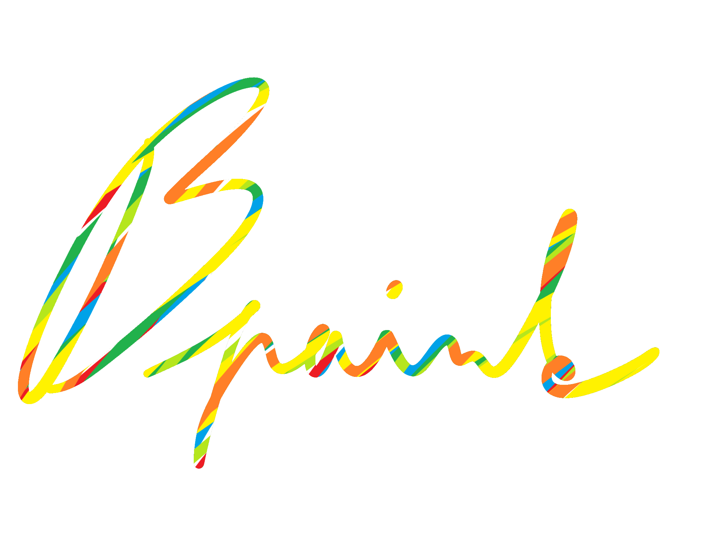

# B-paint



B-paint is a simple painting application created in Python using the Tkinter library. It allows users to draw, change colors, brush sizes, and save their creations as images.

## Features

- **Drawing**: Users can draw on the canvas using various tools (brush, pencil, spray, eraser, rectangle, circle, text).
- **Color Selection**: Users can select colors using a color palette or a color chooser dialog.
- **Saving Images**: Users can save their creations as PNG or JPEG files.
- **Opening Images**: Users can open existing images and edit them.
- **Language Change**: The application supports multiple languages (e.g., English and Czech).
- **Themes**: Users can switch between light and dark themes.

## Requirements

- Python 3.x
- Pillow library (install using `pip install Pillow`)

## Installation

1. Clone the repository:
   ```bash
   git clone https://github.com/syntax01001/Bpaint.git
   cd Bpaint
   pip install -r requirements.txt
   python setup.py
   python main.py
